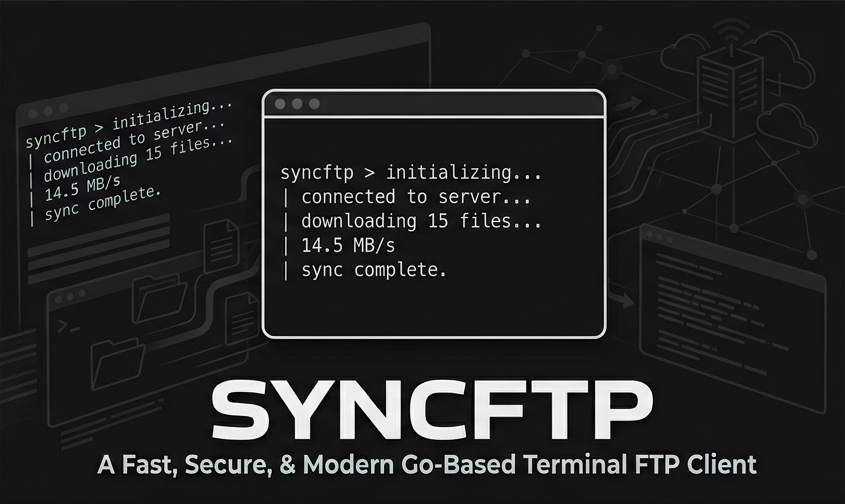

# syncFTP



A Go CLI tool that detects changed files via SHA256 hashing and distributes them to one or more FTP servers.

- **No git required** — change detection is hash-based, works in any directory
- **Multi-server** — deploy to production and staging in a single command, in parallel
- **Server-side protection** — never overwrites `.env`, database configs, or any file you mark as protected
- **Freeze list** — per-server list of files that are permanently skipped even when changed locally
- **Connection profiles** — share one set of FTP credentials across multiple servers
- **Parallel uploads** — configurable connection pool per server; multiple servers sync simultaneously
- **Auto-retry** — failed uploads are retried automatically and saved for manual re-runs
- **Config-free mode** — sync any directory to any FTP without a project config (`syncftp push`)
- **HTTP API** — built-in local API server for PHP/web UI integration (`syncftp serve`)
- **Interactive shell** — run `syncftp` with no arguments for a full TUI shell with arrow-key file browser, server picker, and action menus
- **CRLF normalization** — line endings are normalized before upload so PHP hosting servers don't inject blank lines
- **Per-server local path** — each server can watch a different subdirectory; useful for monorepos
- **Calibrate** — reconcile an existing deployment without re-uploading everything; compares file sizes (CRLF-aware) and initializes state
- **Minify** — strip comments and whitespace from CSS/JS files before upload (pure Go, no external tools)
- **Obfuscate** — run `terser --compress --mangle` on JS files before upload (requires `npm install -g terser`)
- **Block extensions** — skip files by extension (e.g. `.jpg`, `.zip`, `.pdf`) per-server or globally
- **Webhook** — send an HTTP POST to any URL after each sync with upload summary (Slack, Discord, custom endpoints)
- **Watch mode** — monitor directories for changes and sync automatically; uses OS kernel events (zero CPU when idle)
- **Config export** — print config as JSON with all passwords masked (`syncftp config --export`)
- **Server diff** — compare two servers' FTP contents (`syncftp diff production staging`)
- **Pre/post sync hooks** — run custom shell commands before and after each sync (build steps, cache clears, migrations)
- **Sync logs & report** — every sync writes a timestamped log to `.syncftp/logs/`; the TUI shows total bytes and duration, press `s` to save its log
- **Ignore templates** — `syncftp init` offers ready-made ignore templates (Laravel, WordPress, Node.js, generic)

The UI auto-detects your OS language (Turkish or English). Switch manually with `syncftp lang tr` (or `lang tr` inside the shell). The preference is saved to `.syncftp/lang`. Use `SYNCFTP_LANG=tr` to override for a single session without saving.

---

## Installation

Requires **Go 1.21+** → https://go.dev/dl/

```bash
git clone <repo>
cd syncftp
go mod tidy
go build -o syncftp.exe ./cmd/syncftp/   # Windows
go build -o syncftp     ./cmd/syncftp/   # Linux / macOS
```

---

## Quick Start

```bash
cd /path/to/your/project

syncftp init      # interactive wizard — creates .syncftp/syncftp.json
syncftp status    # show what has changed (nothing is uploaded)
syncftp sync      # upload changed files to all enabled servers
```

**Adding syncFTP to an already-deployed project?** Run `syncftp calibrate` after `init` — it compares local file sizes with the server and populates the sync state without uploading anything. After that, `status` and `sync` only show/upload actual differences.

---

## Configuration — `.syncftp/syncftp.json`

Created by `syncftp init` inside the `.syncftp/` directory. Stored with permission `600`. `.syncftp/` is added to `.gitignore` automatically.

```json
{
  "project": {
    "name": "my-project",
    "default_path": "."
  },
  "sync": {
    "protect": [".env", "config/database.php", "storage/"],
    "include": [],
    "exclude": ["vendor/", "node_modules/"],
    "ignore_files": [],
    "webhook": "https://hooks.example.com/deploy",
    "block_extensions": [".jpg", ".zip", ".pdf"],
    "pre_sync": ["npm run build"],
    "post_sync": ["curl -s https://example.com/clear-cache"]
  },
  "first_sync": {
    "full": false
  },
  "connections": [
    {
      "name": "my-host",
      "host": "ftp.example.com",
      "port": 21,
      "user": "ftpuser",
      "password": "secret",
      "passive": true
    }
  ],
  "servers": [
    {
      "name": "production",
      "connection": "my-host",
      "remote_path": "/public_html",
      "enabled": true,
      "max_connections": 3,
      "max_retries": 2,
      "minify": true,
      "obfuscate": false,
      "webhook": "",
      "block_extensions": []
    },
    {
      "name": "staging",
      "connection": "my-host",
      "remote_path": "/staging",
      "enabled": true,
      "max_connections": 1,
      "max_retries": 2
    }
  ]
}
```

> **Without connection profiles** — enter credentials directly on the server:
>
> ```json
> {
>   "name": "production",
>   "host": "ftp.example.com",
>   "port": 21,
>   "user": "ftpuser",
>   "password": "secret",
>   "remote_path": "/public_html",
>   "passive": true,
>   "enabled": true,
>   "max_connections": 3,
>   "max_retries": 2
> }
> ```

> **Per-server local directory** — each server can watch a different local subdirectory:
>
> ```json
> {
>   "project": { "name": "monorepo", "default_path": "." },
>   "servers": [
>     { "name": "frontend", "local_path": "frontend/", "remote_path": "/public_html" },
>     { "name": "admin",    "local_path": "admin/",    "remote_path": "/public_html/admin" }
>   ]
> }
> ```
> When `local_path` is absent, the server inherits `project.default_path`.

### Field Reference

| Field | Default | Description |
|---|---|---|
| `project.default_path` | `"."` | Local directory to scan (relative to `syncftp.json`; ignored when server has its own `local_path`) |
| `project.local_path` | — | **Deprecated** — old name for `default_path`; auto-migrated on first load |
| `sync.protect` | `[]` | Files/dirs that are **never** overwritten on the FTP server (all servers) |
| `sync.include` | `[]` | Global whitelist — sync only these paths (empty = all) |
| `sync.exclude` | `[]` | Global blacklist — always skip these paths |
| `sync.ignore_files` | `[]` | Which ignore files to load — empty means both `.gitignore` and `.syncftp/syncftp.ignore` |
| `first_sync.full` | `false` | `true` = force upload everything on first sync, skip calibrate |
| `connections[].name` | — | Profile name — referenced by `server.connection` |
| `connections[].host` | — | FTP server address |
| `connections[].port` | `21` | FTP port |
| `server.connection` | `""` | Name of a connection profile — if set, host/port/user/password/passive come from there |
| `server.local_path` | `""` | Per-server local directory override; empty = inherit `project.default_path` |
| `server.remote_path` | — | Target directory on the FTP server |
| `server.disable_epsv` | `false` | Disable EPSV, use PASV only — fixes some NAT/firewall setups |
| `server.nat_workaround` | `false` | Ignore the IP in PASV response, use server host instead |
| `server.max_connections` | `1` | Parallel FTP connections for this server |
| `server.max_retries` | `2` | Retry count on upload failure (0 = no retry) |
| `server.include` | `[]` | Per-server whitelist — overrides global `sync.include` |
| `server.exclude` | `[]` | Per-server blacklist — added on top of global `sync.exclude` |
| `server.protect` | `[]` | Per-server protect list — never overwrite these paths on this server |
| `server.enabled` | `true` | Set `false` to skip this server in all sync operations |
| `server.minify` | `false` | Strip comments and whitespace from `.css`/`.js` before upload |
| `server.obfuscate` | `false` | Run `terser --compress --mangle` on `.js` files (requires `npm i -g terser`) |
| `server.block_extensions` | `[]` | Skip files with these extensions (e.g. `[".jpg", ".zip"]`); merged with global list |
| `server.webhook` | `""` | Override the global webhook URL for this server |
| `sync.webhook` | `""` | Global webhook URL — HTTP POST after sync with upload summary |
| `sync.block_extensions` | `[]` | Global list of extensions to skip; per-server list is added on top |
| `sync.pre_sync` | `[]` | Shell commands run **before** upload; any failure aborts that server's sync |
| `sync.post_sync` | `[]` | Shell commands run **after** upload; failures are reported but don't affect the sync |
| `server.pre_sync` / `server.post_sync` | `[]` | Per-server hooks, run after the global ones |

---

## Minify, Obfuscate & Block

### Minify CSS/JS

Enable `server.minify: true` to strip comments and collapse whitespace in `.css` and `.js` files before upload. The original local file is never modified — a temporary copy is created, uploaded, and cleaned up automatically.

```json
{ "name": "production", "minify": true }
```

### Obfuscate JS

Enable `server.obfuscate: true` to run `terser --compress --mangle` on `.js` files before upload. This renames variables/functions to short identifiers, making the code harder to read.

**Requires:** `npm install -g terser`

If `terser` is not found in PATH, a warning is printed and the file is uploaded without obfuscation.

Minify and obfuscate can be used together — minify runs first, then terser processes the result.

### Block extensions

Skip files by extension — they are counted and reported but never uploaded.

```json
{
  "sync": { "block_extensions": [".jpg", ".png", ".zip"] },
  "servers": [
    { "name": "assets", "block_extensions": [".pdf"] }
  ]
}
```

Per-server list is **added on top** of the global list (not a replacement).

### Webhook

Send an HTTP POST after each sync completes. Useful for triggering cache clears, deploys, or notifications.

```json
{ "sync": { "webhook": "https://hooks.example.com/deploy" } }
```

**POST body:**

```json
{
  "server":   "production",
  "uploaded": 5,
  "failed":   0,
  "files":    ["index.php", "css/app.css", "js/app.js"]
}
```

Per-server `webhook` overrides the global one for that server.

### Pre/post sync hooks

Run arbitrary shell commands around each sync — build steps, cache clears, database migrations, notifications.

```json
{
  "sync": {
    "pre_sync":  ["npm run build"],
    "post_sync": ["curl -s https://example.com/api/clear-cache"]
  },
  "servers": [
    { "name": "production", "post_sync": ["curl -s https://prod.example.com/migrate"] }
  ]
}
```

- Commands run through the system shell (`cmd /C` on Windows, `sh -c` elsewhere) in the project directory; their output is shown indented under a `⚙ hook:` line.
- **`pre_sync`** runs after the file list is computed but before any upload — only when there is something to upload, and never on `--dry-run`. If a command fails, **that server's sync is aborted**.
- **`post_sync`** runs after the upload (and webhook). Failures are printed but don't change the sync result.
- Per-server hooks run **after** the global ones.
- Hooks receive context via environment variables: `SYNCFTP_SERVER`, `SYNCFTP_UPLOADED`, `SYNCFTP_FAILED` (counts are `0` in `pre_sync`).
- With parallel multi-server sync, hooks of different servers may run concurrently — keep them independent.

### Binary files

Binary files (images, PDFs, archives, fonts, media…) are uploaded byte-for-byte — the CRLF normalizer is skipped so they are never corrupted. Detection is two-layered: a known-binary extension list (`.jpg`, `.png`, `.pdf`, `.zip`, `.woff2`, `.mp4`, …) decides instantly; anything else is content-sniffed for null bytes in the first 8 KB.

---

## Ignore Files

syncFTP loads **both** `.gitignore` and `.syncftp/syncftp.ignore` if they exist and merges their patterns. You can control which files are loaded via `sync.ignore_files` in `.syncftp/syncftp.json`.

| `sync.ignore_files` value | Behavior |
|---|---|
| `[]` or field absent | Load `.gitignore` + `.syncftp/syncftp.ignore` (default) |
| `[".gitignore"]` | Only `.gitignore` |
| `[".syncftp/syncftp.ignore"]` | Only `.syncftp/syncftp.ignore` |

**Typical setup** — keep `.gitignore` for git, add FTP-specific ignores to `.syncftp/syncftp.ignore`:

```gitignore
# .syncftp/syncftp.ignore
vendor/
node_modules/
*.log
.DS_Store
uploads/
```

The `.syncftp/` metadata directory is always excluded from scanning regardless of ignore rules.

---

## Commands

### `syncftp init`

Interactive wizard. Prompts for project name, FTP credentials, and writes `.syncftp/syncftp.json`. Also adds `.syncftp/`, `syncftp.exe`, and `syncftp` to `.gitignore`.

After the basic questions, a template picker offers a ready-made `.syncftp/syncftp.ignore` for **Laravel**, **WordPress**, **Node.js**, or a **generic** project (or none). An existing `syncftp.ignore` is never overwritten.

```
=== syncFTP Setup Wizard ===

Project name [my-project]:
Local directory [.]:

Server name [production]:
FTP host: ftp.example.com
Port [21]:
Username: ftpuser
Password: ****
Remote directory [/public_html]:
```

---

### `syncftp status`

Shows what has changed since the last sync. **Nothing is uploaded.**

```bash
syncftp status
syncftp status --include css
syncftp status --exclude vendor
syncftp status --server production
```

```
Project : my-project

── production (ftp.example.com) ──
Dir     : /home/user/my-project
Files   : 142

  + NEW (2):
      js/utils.js
      css/dark-mode.css
  ~ CHANGED (1):
      index.php
  - DELETED locally (not removed from FTP) (1):
      old-file.php
```

> Deleted files are reported but **never removed** from the FTP server — intentional safety behaviour.

If the server has a freeze list, frozen files are listed at the end under `❄ Frozen (skipped during sync)`.

Running `syncftp status` without arguments opens an interactive TUI where you can browse per-server changes and launch a sync directly.

**First run behaviour:** if no sync state exists yet, `status` automatically runs `calibrate` first to compare local file sizes with the server. This prevents showing hundreds of false "new file" entries on a project that's already deployed.

---

### `syncftp sync`

Uploads changed files to all enabled servers.

```bash
syncftp sync                          # server picker opens if multiple servers configured
syncftp sync --all                    # skip picker, sync to all enabled servers
syncftp sync --server production      # one specific server
syncftp sync --full                   # ignore state, re-upload everything
syncftp sync --dry-run                # preview what would be uploaded
syncftp sync --retry-failed           # re-upload files that failed in the last run
syncftp sync --include css --include js/app.js
syncftp sync --exclude vendor --exclude tests
```

**First run behaviour:** on the very first run (no sync state), `sync` automatically runs `calibrate` to compare local file sizes with the server. Only files that are missing or have a different size are uploaded. Use `--full` to force a complete re-upload and skip calibrate.

**Failsafe cleanup:** before each sync, syncFTP checks the `include`, `exclude`, and `protect` lists for exact file paths that no longer exist locally and removes them automatically, printing a warning. Glob patterns (`*.log`) and directories (`vendor/`) are not affected.

**Example output:**

```
Scanning: /home/user/my-project
142 files found

══ production (ftp.example.com) ══
  First run: running calibrate (server comparison)...
  [production]
  Local:  142 files scanned
  Connecting to server... connected
  / Listing remote files...
  Remote: 139 files found
  Comparing: 142 / 142
  Matched: 139 (size OK)  |  Different/missing: 3
  [production] resync done

  ❄ 2 frozen (skipped)
  3 files to process
  Connection pool: 3 / Retry: 2
    ✓ js/utils.js
    ✓ css/dark-mode.css
    ✓ index.php
  Done: 3 uploaded, 0 protected, 0 failed
  ↑ 1.2 MB · 4s
  Release: .syncftp/releases/production/20260612-143012
Log: .syncftp/logs/production/20260612-143012.txt
```

Every sync that uploads (or fails to upload) at least one file also writes a plain-text log to `.syncftp/logs/<server>/<timestamp>.txt`. In the interactive sync TUI, press `s` after the sync finishes to save its log.

---

### `syncftp diff`

Compares the FTP contents of two servers — useful for checking production against staging.

```bash
syncftp diff production staging       # explicit server names
syncftp diff                          # interactive pickers
```

```
── production ↔ staging ──
  Listing production...
  Listing staging...

  Only on production (2):
    + js/new-feature.js
    + css/dark.css
  Size differs (1):
    ~ index.php  (production: 12.4 KB · staging: 11.9 KB)
  ✓ 139 files identical
```

---

### `syncftp watch`

Watches local directories for file changes and automatically syncs to the FTP server when a change is detected. Uses OS-level file system events (no polling) so CPU usage is near zero when idle.

```bash
syncftp watch                        # server picker if multiple servers
syncftp watch --server production    # one specific server
syncftp watch --all                  # all enabled servers simultaneously
```

An 800 ms debounce is applied — rapid saves (e.g. auto-formatter running) are batched into a single sync. Newly created subdirectories are added to the watch automatically.

Press `Ctrl+C` to stop.

---

### `syncftp calibrate`

Reconciles an already-deployed project without uploading anything. Compares local file sizes with FTP remote sizes and writes matching hashes to the sync state. After calibrate, `status` and `sync` only show actual differences.

```bash
syncftp calibrate                        # all enabled servers
syncftp calibrate --server production    # one specific server
syncftp calibrate --all                  # explicitly all servers (including disabled)
```

**When to use manually:**
- Added syncFTP to an existing project and don't want to re-upload everything
- Sync state was deleted or corrupted
- Files were deployed via another tool and you want to bring syncFTP up to date

**How it works:** for each local file, the remote size is checked. If sizes match (accounting for CRLF normalization — files uploaded by syncFTP have `\r\n` stripped, so remote is smaller by one byte per CRLF line), the file's local hash is written to state. Files that are missing on the server or have a different size will be uploaded on the next `sync`.

```
  [production]
  Local:  142 files scanned
  Connecting to server... connected
  Listing: 3944 files   (→ show files | ← hide | ctrl+c cancel)
  Remote: 3944 files found
  Comparing: 142 / 142
  Matched: 139 (size OK)  |  Different/missing: 3
  [production] calibrate done
  Log: .syncftp/logs/production/20260723-152201.txt
```

While the remote listing runs, press **`→`** to stream the file paths being scanned live (last 10 shown), **`←`** to hide them again, or **`ctrl+c`** to cancel. When calibrate finishes, the summary plus the full list of scanned remote files (with sizes) is saved to `.syncftp/logs/<server>/`.

> Note: calibrate is also triggered **automatically** by `status` and `sync` on the first run (when no state file exists). You only need to run it manually if the state was lost or you want to force a re-reconciliation. The automatic version uses a plain counter (no interactive keys, no log) since it may run for several servers in parallel.

---

### `syncftp milestone`

Sets a per-server **time marker**. While a milestone exists, `status` and `sync` only consider files modified (mtime) after that date — everything older is filtered out. Perfect for "deploy only what I changed since this morning" workflows.

```bash
syncftp milestone set                       # milestone = now (server picker if multiple)
syncftp milestone set --date "3d"           # 3 days ago
syncftp milestone set -s production --date "20.07 14:30"
syncftp milestone                           # show milestones (same as: milestone show)
syncftp milestone sync [--dry-run]          # upload ALL files modified after the milestone
syncftp milestone clear                     # remove the milestone → full lists return
```

Accepted date formats (local time, language-independent — Turkish and English keywords both always work):

| Input | Meaning |
|---|---|
| `now` / `şimdi` | right now |
| `today` / `bugün`, `yesterday` / `dün` | that day at 00:00 |
| `30m`, `5h`, `3d`, `2w` | that long ago |
| `14:30` | today at 14:30 |
| `20.07`, `20.07.2026 14:30` | day.month[.year] |
| `2026-07-20 15:04` | ISO format |

**Two modes:**

- **Standing filter** — while the milestone exists, normal `status`/`sync` (CLI, shell, watch and the serve API) skip files whose mtime is older than the milestone. A `⏱ Milestone filter (...)` note shows how many files were hidden; the shell status TUI shows a `⏱ date` badge next to the server.
- **`milestone sync`** — force-uploads *every* file modified after the milestone regardless of the hash state. Uploaded hashes are written to state so a following `sync` doesn't re-upload them.

`sync --retry-failed` ignores the milestone filter on purpose. Milestones are stored in `.syncftp/milestones/<server>.json`.

In the interactive shell the `milestone` command operates on the **connected server**: `milestone set [date]`, `milestone sync [--dry-run]`, `milestone clear`, `milestone` (show).

---

### `syncftp freeze`

Manages the **freeze list** for a server — files marked as frozen are permanently skipped during sync even if changed locally. Useful for files that differ intentionally between local and server (config overrides, server-specific assets, etc.).

```bash
syncftp freeze                        # server picker if multiple servers
syncftp freeze --server production    # specific server
```

Opens a full-screen TUI where you can browse all local files, toggle freeze with `Space`, filter by typing, and save with `Enter`.

```
🧊 Freeze list — production
  Type to filter  |  Space = freeze/unfreeze  |  a = toggle all  |  Enter = save  |  q = cancel
  ──────────────────────────────────────────────────────────────────
▶ [❄]  config/database.php
  [❄]  config/smtp.php
  [ ]  index.php
  [ ]  js/app.js
  ──────────────────────────────────────────────────────────────────
  ❄ 2 frozen  ·  4/142 shown
```

Freeze lists are stored per-server in `.syncftp/frozen/<server>.json`. To clear all freezes: open the TUI, press `a` to unmark all, then `Enter`.

You can also toggle freeze directly from the **file browser** (`ls` command or `syncftp remote ls`) by pressing `f` on any file or folder. Pressing `f` on a folder freezes/unfreezes all files inside it recursively. Frozen files show `❄` icon, folders with frozen contents show `❄📁`.

---

### `syncftp push`

Syncs **any local directory** to an FTP server without needing a `syncftp.json`. Useful for one-off deployments or scripting.

```bash
syncftp push ./website --host ftp.example.com --user admin --pass secret --remote /public_html
syncftp push ./website --host ftp.example.com --user admin --pass secret --remote /public_html --connections 3
syncftp push ./another-project --server production
syncftp push ./website --host ftp.example.com --user admin --pass secret --remote /public_html --dry-run
syncftp push ./website --host ftp.example.com --user admin --pass secret --remote /public_html --full
```

State is stored in `<local-dir>/.syncftp/` so subsequent runs only upload changed files.

**Flags:**

| Flag | Default | Description |
|---|---|---|
| `--host` | — | FTP server address (required unless `--server` is used) |
| `--port` | `21` | FTP port |
| `--user` | — | Username |
| `--pass` | — | Password |
| `--remote` | `"/"` | Remote target directory |
| `--passive` | `true` | Use passive mode |
| `--server` | — | Reuse a server from `syncftp.json` |
| `--full` | `false` | Re-upload all files, ignore state |
| `--dry-run` | `false` | Preview without uploading |
| `--include` | — | Whitelist (repeatable) |
| `--exclude` | — | Blacklist (repeatable) |
| `--connections` | `1` | Parallel FTP connections |
| `--retries` | `2` | Retry count on failure |

---

### `syncftp remote`

Browse, download, preview and delete files on the FTP server.

```bash
syncftp remote ls                          # open interactive file browser
syncftp remote ls css/                     # open browser starting at css/
syncftp remote ls --server staging

syncftp remote cat index.php               # preview first 10 KB
syncftp remote cat                         # open file browser to pick a file
syncftp remote cat error.log --max-kb 50

syncftp remote get index.php               # download to current directory
syncftp remote get                         # open file browser to pick a file
syncftp remote get css/style.css ~/tmp/

syncftp remote rm old-file.php             # delete file (TUI confirmation)
syncftp remote rm                          # open file browser to pick a file
syncftp remote rm old-file.php --force
syncftp remote rm cache/ --recursive
```

---

### `syncftp config`

Manage servers, connection profiles, and global sync settings interactively — no need to edit `syncftp.json` by hand.

```bash
syncftp config             # interactive TUI
syncftp config --export    # print config as JSON with passwords masked
```

`--export` is safe to commit or share — all `password` fields are replaced with `"***"`. Redirect to a file with `syncftp config --export > template.json`.

Inside the interactive shell, use `config` without the `syncftp` prefix.

```
⚙  Server Ayarları
  ↑↓ gezin  |  Enter/e = düzenle  |  Space = aç/kapat  |  d = sil  |  n = yeni  |  q = çık
  ──────────────────────────────────────────────────────────────────────────

  ⚙ Global Ayarlar  (protect, include, exclude, ignore_files)
  🔗 Bağlantı Profilleri  (1 profil)
▶ ✓  production    → my-host:21/public_html    conn:3  retry:2
   ✓  staging       → my-host:21/staging        conn:1  retry:2
   + Yeni server ekle

  2 server  |  1 bağlantı profili
```

#### Server list navigation

| Key | Action |
|---|---|
| `↑` / `↓` or `j` / `k` | Navigate |
| `Enter` / `e` | Edit — opens field navigator |
| `Space` | Toggle server enabled / disabled — saves immediately |
| `d` | Delete server — inline `y` confirmation |
| `n` | Add new server |
| `q` / `Esc` | Close |

The first row opens **Global Settings** (default directory, protect, include, exclude, ignore_files). The second row opens **Connection Profiles**. The last row adds a new server.

#### Connection Profiles

Connection profiles store shared FTP credentials. Multiple servers can reference the same profile — when credentials change, you update only the profile.

Selecting **Bağlantı Profilleri** opens the profile manager:

```
🔗  Bağlantı Profilleri
  ↑↓ gezin  |  Enter/e = düzenle  |  d = sil  |  n = yeni  |  q = çık
  ──────────────────────────────────────────────────────────────────
▶ 🔗 my-host               ftp.example.com:21  ftpuser
  + Yeni profil ekle
```

Each profile has: **Name**, **Host**, **Port**, **User**, **Password**, **Passive mode**, **Disable EPSV**, **NAT workaround**.

#### Field navigator (server edit screen)

All 21 fields are listed in a single screen. Navigate with arrow keys.

```
⚙  Server Düzenle
  ↑↓ gezin  |  Enter/b = düzenle/seç  |  Space = bool toggle  |  s = kaydet  |  q = iptal
  ─────────────────────────────────────────────────────────
  Ad                production
▶ Connection        my-host  [b=değiştir]
  Host              ftp.example.com  ↳ my-host
  Port              21               ↳ my-host
  Kullanıcı         ftpuser          ↳ my-host
  Şifre             ****             ↳ my-host
  Uzak dizin        /public_html
  Yerel dizin       (project default)  [b=gözat]
  Aktif             ✓
  Passive mode      ✓                ↳ my-host
  EPSV devre dışı   ○                ↳ my-host
  NAT workaround    ○                ↳ my-host
  Max bağlantı      3
  Max retry         2
  Include           (boş)  [b=gözat]
  Exclude           vendor/  [b=gözat]
  Protect           .env, config/db.php  [b=gözat]
  Webhook URL       https://hooks.example.com/deploy
  Minify CSS/JS     ✓
  Obfuscate JS      ○
  Block extensions  .jpg, .zip, .pdf  [b=seç]
```

When a connection profile is selected, credential fields (Host, Port, User, Password, Passive, EPSV, NAT) are shown read-only with `↳ profile-name`. Navigation automatically skips them. To edit credentials, go to **Connection Profiles** and edit the profile there.

| Key | Action |
|---|---|
| `↑` / `↓` or `j` / `k` | Move between fields (skips locked credential fields) |
| `Enter` | Text/int/password: start inline edit; bool: toggle; Connection: open profile picker |
| `Space` | Bool fields: toggle |
| `b` | Connection: open profile picker; local dir: open directory picker; list fields: open local file browser |
| `s` | Save and return |
| `q` / `Esc` | Cancel |

#### Local file browser (for include / exclude / protect)

Opens from the project's local directory. Existing list entries that are found on disk are pre-marked.

| Key | Action |
|---|---|
| `↑` / `↓` or `j` / `k` | Navigate |
| `Enter` / `→` | Enter directory |
| `←` / `Esc` | Go up |
| `Space` | Mark / unmark file or folder |
| `a` | Toggle all in current view |
| `n` | Enter a custom path (for glob patterns, paths outside project root, etc.) |
| `s` | Save selection and return |
| `q` | Cancel — previous list unchanged |

Items that are not filesystem paths (glob patterns like `*.log`, paths outside the root) are kept in the list unchanged when saving from the browser.

---

### `syncftp` (Interactive Shell)

Run `syncftp` with no arguments to open the interactive shell.

```bash
syncftp
```

#### Shell Commands

| Command | Description |
|---|---|
| `ls [path]` | Open arrow-key file browser |
| `tree [path] [--max N]` | FTP directory as tree — `--max N` limits items per dir (interactive if omitted) |
| `cd <path>` | Change remote directory (`cd ..` to go up) |
| `cat [file]` | Preview file content |
| `get [file] [dest]` | Download file |
| `rm [-f] [-r] [file]` | Delete file/dir |
| `pwd` | Show current remote path |
| `status` | Show local changes per server (opens TUI) |
| `sync [--all] [--full] [--dry-run] [--server name]` | Upload to FTP |
| `watch [--all] [--server name]` | Watch for file changes and sync automatically |
| `calibrate [--all] [--server name]` | Compare local sizes with FTP, update state (no upload) |
| `milestone [set [date] \| sync \| clear \| show]` | Time marker on the connected server — see `syncftp milestone` |
| `freeze [--server name]` | Manage freeze list for a server |
| `serve [--port N]` | Start the local HTTP API server (same as `syncftp serve`) |
| `servers` | TUI server list |
| `server [name]` | Connect to a server |
| `disconnect` | Close current FTP connection |
| `config` | Add, edit or delete servers and connection profiles |
| `lang [en\|tr]` | Show or change display language |
| `clear` / `cls` | Clear screen |
| `help` / `?` | Show command reference |
| `exit` / `quit` | Exit shell |

#### File Browser

Opened by `ls`, or automatically when `cat`/`get`/`rm` receive no path argument.

| Key | Action |
|---|---|
| `↑` / `↓` or `j` / `k` | Navigate |
| `Enter` | Enter directory / select file |
| `→` / `l` | Enter directory; on a file: load full-screen preview |
| `←` / `h` / `ESC` | Go up one directory |
| `g` / `G` | Jump to first / last item |
| `/` | Search — type to filter; `Enter` = recursive server-wide search |
| `Space` | Toggle mark on file or folder |
| `a` | Mark all / unmark all (disabled during search) |
| `f` | **Freeze/unfreeze** file; on a folder: toggle all files inside recursively |
| `d` | Delete all marked items (double confirmation) |
| `m` | Move all marked items — pick destination in second browser |
| `t` | Open **tree view** of current directory |
| `r` | Reconnect to server (after connection drop) |
| `q` | Close browser |

- Frozen files show `❄` icon; folders with frozen contents show `❄📁`
- Folder item counts loaded in background: `...` → `N items` or `1000+` or `?` on error
- Preview panel on terminals ≥ 120 chars wide — loaded on demand (`→`), not on every cursor move
- Recursive search with `/` + `Enter`: streams results as found, uses `maxConnections` parallel FTP clients, 5-minute timeout, `ESC` cancels and closes all connections
- Selecting a single file opens an action menu: **View / Download / Delete / Cancel**
- Command history saved to `.syncftp/shell_history`

#### Sync Progress (TUI)

When `sync` runs, a full-screen progress view is shown. Failed files display each retry attempt's error separately:

```
  ══ production ══

  ████████████████░░░░░░░░░░░░░░░░  52%  13/25

  ⠙ css/components/button.css

  ✓ index.php
  ✓ js/app.js
  ✗ img/hero.jpg  (3 attempts)
       attempt 1: connection reset by peer
       attempt 2: broken pipe
       attempt 3: connection reset by peer
  ✓ css/components/button.css
```

#### Tree command

```bash
tree                        # tree from current remote directory (interactive max-items prompt)
tree /public_html           # tree starting at a specific path
tree --max 50               # show first 50 items per dir + "+N more..."
tree --max 0                # show everything (no limit)
```

```
/public_html
├─ 📁 css/
│  ├─ 📄 main.css  (45.3 KB)
│  └─ 📄 bootstrap.min.css  (152.1 KB)
├─ 📁 js/
│  └─ 📄 app.js  (23.7 KB)
├─ 📄 index.php  (12.4 KB)
└─ 📁 uploads/
   ├─ 📄 logo.png  (8.1 KB)
   └─ +457 daha...
```

---

### `syncftp lang`

Show or change the display language.

```bash
syncftp lang        # show current language
syncftp lang en     # switch to English
syncftp lang tr     # switch to Turkish
```

Preference saved to `.syncftp/lang`. The language is **auto-detected** from the OS on first run (Windows UI language via `kernel32.dll`, Unix via `LANG`/`LC_ALL` env vars) — Turkish systems default to Turkish, everything else to English. Use `SYNCFTP_LANG=tr` to override for a single session without saving.

---

### `syncftp serve`

Starts a local HTTP API server.

```bash
syncftp serve              # http://127.0.0.1:8080
syncftp serve --port 9000
```

Only listens on `127.0.0.1`. CORS enabled for all origins.

#### API Endpoints

| Method | Endpoint | Description |
|---|---|---|
| `GET` | `/api/servers` | List configured servers (passwords excluded) |
| `GET` | `/api/status` | Changed files per server |
| `GET` | `/api/status?server=production` | Changed files for one server |
| `POST` | `/api/sync` | Run sync (blocking, returns result JSON) |
| `GET` | `/api/sync/stream?server=&full=false&dry_run=false` | Run sync with **SSE live log** — streams output line by line |
| `GET` | `/api/failed` | Files that failed in last sync |
| `GET` | `/api/releases?server=&limit=10` | Release history (newest first) |
| `POST` | `/api/reload` | Validate and reload config, returns server count |
| `POST` | `/api/trigger/github?server=&branch=main&secret=xxx` | GitHub push webhook → async sync; validates HMAC-SHA256 if `secret` provided |
| `GET` | `/api/remote/ls?server=&path=` | List remote directory |
| `GET` | `/api/remote/ls?server=&path=&recursive=true` | Recursive listing |
| `GET` | `/api/remote/cat?server=&path=&max_kb=10` | Preview file |
| `GET` | `/api/remote/get?server=&path=` | Download file (raw) |
| `GET` | `/api/remote/get?server=&path=&json=true` | Download file (base64 JSON) |
| `DELETE` | `/api/remote/rm?server=&path=` | Delete file |
| `DELETE` | `/api/remote/rm?server=&path=&recursive=true` | Delete directory |

**SSE live log** — connects once, receives each log line as it happens:

```js
const es = new EventSource('http://127.0.0.1:8080/api/sync/stream?server=production');
es.onmessage = e => console.log(e.data);
es.onerror   = () => es.close();
```

```bash
curl -N "http://127.0.0.1:8080/api/sync/stream?server=production"
```

**POST /api/sync body:**

```json
{
  "server":       "production",
  "full":         false,
  "dry_run":      false,
  "include":      ["css/"],
  "exclude":      ["vendor/"],
  "retry_failed": false
}
```

---

## Filtering System

Four independent mechanisms that work together:

### 1. `protect` — permanent server-side protection

Files in `sync.protect` are **never uploaded**. Use for server-specific files that must not be overwritten.

```json
"sync": { "protect": [".env", "config/database.php", "storage/"] }
```

### 2. Freeze list — per-server permanent skip

Files in a server's freeze list are skipped during sync even when changed locally. Managed via `syncftp freeze` or the `f` key in the file browser. Stored in `.syncftp/frozen/<server>.json`.

Unlike `protect` (which is global and config-based), freeze lists are:
- **Per-server** — a file can be frozen for production but not staging
- **Managed interactively** — no need to edit JSON manually
- **FTP-path aware** — toggled from the remote browser

### 3. `include` / `exclude` — config and CLI filters

```json
"sync": { "exclude": ["vendor/", "node_modules/", "tests/"] },
"servers": [
  { "name": "production", "include": ["css/", "js/", "index.php"] }
]
```

**Priority (include):** CLI `--include` → server `include` → global `sync.include`

**Priority (exclude):** global `sync.exclude` + server `exclude` + CLI `--exclude` (all combined)

**Failsafe auto-cleanup:** exact file paths (not globs, not directories) in include/exclude/protect are automatically removed if the file no longer exists on disk. A warning is printed and the config is saved.

### 4. Milestone — time-based filter

While a server has a milestone (`syncftp milestone set`), `status` and `sync` only consider files modified after the milestone date. See the [`syncftp milestone`](#syncftp-milestone) command.

### Summary

| Mechanism | Scope | Managed via |
|---|---|---|
| `sync.protect` | Global, all servers | `syncftp.json` |
| Freeze list | Per-server, file-level | `syncftp freeze` / browser `f` key |
| Milestone | Per-server, mtime-based | `syncftp milestone` / shell `milestone` |
| `sync.include` / `sync.exclude` | Global | `syncftp.json` |
| `server.include` / `server.exclude` | Per-server | `syncftp.json` |
| `--include` / `--exclude` flags | This run only | CLI |
| `sync.ignore_files` | File scanner | `syncftp.json` |

---

## State & Release Files

syncFTP stores everything in `.syncftp/` in your project directory:

```
.syncftp/
├── syncftp.json           # project config (created by syncftp init)
├── syncftp.ignore         # FTP-specific ignore patterns (optional)
├── state/
│   ├── production.json    # per-file hashes from last successful sync
│   └── staging.json
├── failed/
│   └── production.json    # files that failed last run (cleared on success)
├── frozen/
│   ├── production.json    # freeze list for production server
│   └── staging.json
├── milestones/
│   └── production.json    # per-server milestone (time marker)
├── releases/
│   └── production/
│       └── 20260612-143012/
│           └── manifest.json
├── logs/
│   └── production/
│       └── 20260612-143012.txt   # plain-text sync log (auto + TUI `s` key)
└── lang                   # saved language preference ("en" or "tr")
```

`.syncftp/` is always excluded from scanning and never uploaded.

---

## Internal Structure

| Package | Role |
|---|---|
| `internal/config` | JSON config loading — Connection profiles, per-server credential resolution |
| `internal/ignore` | `.gitignore` + `syncftp.ignore` merged parser |
| `internal/scanner` | Directory walk, SHA256 hashing |
| `internal/state` | Per-server sync state (load / save / diff) |
| `internal/ftp` | FTP client, connection pool, CRLF normalizer |
| `internal/failed` | Failed file list persistence |
| `internal/release` | Release manifest writer |
| `internal/frozen` | Per-server freeze list (load / save) |
| `internal/milestone` | Per-server milestone time marker (load / save / clear) |
| `internal/synclog` | Sync log writer — ANSI-stripped plain-text logs under `.syncftp/logs/` |
| `internal/lang` | i18n — `lang.go` (struct + funcs), `en.go` (English), `tr.go` (Turkish); auto-detect OS language, runtime switching |
| `cmd/syncftp` | CLI commands (init, status, sync, calibrate, milestone, push, remote, serve, freeze, lang, config, watch, diff, shell) |

---

## Running Tests

```bash
go test ./...
go test ./internal/state/... -v
go test ./internal/scanner/...
```
